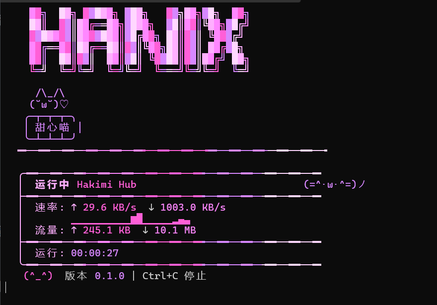

# Hakimi Hub

一个 CLI 工具，采用 PAC 本地反代方案加速 GitHub,Steam 访问

本项目受 [Steam++ (Watt Toolkit)](https://github.com/BeyondDimension/SteamTools) 启发而开发。Steam++ 功能丰富但内存占用较大，Hakimi Hub 是一个更轻量的选择



## 功能特性
- 启动会随机出现各种哈吉米（
- DoH 解析
- IP 测速优选
- SNI 伪装
- 镜像站代理

### 从源码编译

```bash
git clone https://github.com/NLick47/hakimi-hub.git
cd hakimi-hub
cargo build --release
```

编译后二进制文件位置：
- **Windows:** `target/release/hakimi-hub.exe`
- **macOS / Linux:** `target/release/hakimi-hub`

## 快速开始

```bash
# 启动代理服务
hakimi-hub start

# 查看状态
hakimi-hub status

# 停止服务
hakimi-hub stop

# 更换哈基米
hakimi-hub theme
```

> **Windows 用户提示：** 如果终端不支持 UI 显示，使用 `hakimi-hub start --no-ui` 以纯日志模式运行。推荐使用 Windows Terminal 或 PowerShell 7+。

## 证书安装

由于使用 MITM 技术解密 HTTPS 流量，首次使用需要安装 CA 证书：

```bash
# 导出证书
hakimi-hub export-ca
```

### Windows

双击导出的 `.crt` 文件 → 安装证书 → 当前用户 → 将这些证书放入以下存储 → 选择「受信任的根证书颁发机构」

或命令行：

```powershell
certutil -addstore -user Root ca.crt
```

### macOS

双击证书文件添加到钥匙串，然后在「钥匙串访问」中双击该证书，将信任设置为「始终信任」。

或命令行：

```bash
sudo security add-trusted-cert -d -r trustRoot -k /Library/Keychains/System.keychain ca.crt
```

### Firefox

Firefox 使用独立证书存储，需手动导入：设置 → 隐私与安全 → 证书 → 查看证书 → 证书颁发机构 → 导入

## 配置

配置文件位置：

- **Windows:** `%APPDATA%\.hakimi-hub\config.toml`
- **macOS:** `~/Library/Application Support/.hakimi-hub/config.toml`

```bash
hakimi-hub config init   # 生成配置文件
hakimi-hub config show   # 查看当前配置
```

## 常见问题

如有问题请提交 [Issues](https://github.com/BeyondDimension/hakimi-hub/issues)。

## License

MIT
